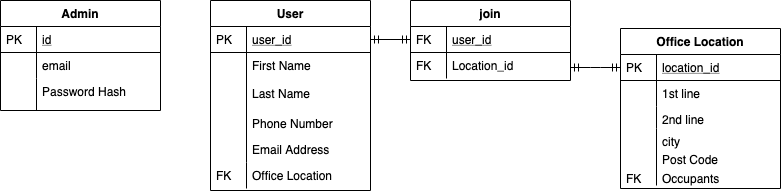
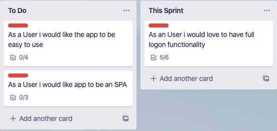
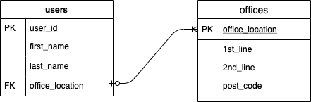

# QACProject

-> Python3

-> Flask

-> SQL Alchemy

-> Selenium

-> Pytest

The Python Micro-Framework Flask is being utilised due to the high amount of integration with components to speed up development. for example SQLAlchemy Models and Flask_WTF Integration for validation and posting errors to the page using Jinja templating (HTML)

Python is seen to be a high level language and is incredibly versatile. many people know python because python does a lot of things!. 
As such further development or making this project opensource could see more collaboration than with other languages.

This Project will use the Feature-Branch Models as well as Test Driven Development. code test coverage must be over 90% to be merged with the development branch for further testing (using Pytest and Selenium)

# Finalised trello board

https://trello.com/b/C6OVfoPZ/qaa

# Finalised ERD

# Finalised Risk Assesstment

Risk assestment can be found [Here](https://docs.google.com/spreadsheets/d/1e9dNWcu6ro9YcTkmCDNhyVzRHGwjEr3RxXqMkqxVKZE/edit?usp=sharing)

# Trello Board progress Tracking 

# Minimum Viable Product

The Minimum Viable Prodect is defines within the To-Do and This Sprint sections of the Trello Board 

There are other User Stories However they are mostly nice to have or more advances features

# First Sprint

As Seen within the Minimum Viable Product only one user story has been chosen for this sprint. This is due to the short sprint time of a day. 
As well as this is one of the more advances features as you can see from the below tasks:

This includes the full system integrated to the Flask Application, with included Integration and Unit Testing so we can continue to ensure it works throughout the project as smaller features are added 

Testing/test_back-end.py .                                               [ 25%]
Testing/test_integration.py ...                                          [100%]

Name                      Stmts   Miss  Cover
---------------------------------------------
application/__init__.py      13      0   100%
application/forms.py         14      4    71%
application/models.py        10      2    80%
application/routes.py        19     10    47%
---------------------------------------------
TOTAL                        56     16    71%

# ERD 

This was the original ERD. This was however changed to: 

Following Client Feedback and the decision to give users a mean to sign into the system

# First Sprint Details

The Goal of the First Sprint was to build the user logon/registration system. 

# First Sprint Test Results

