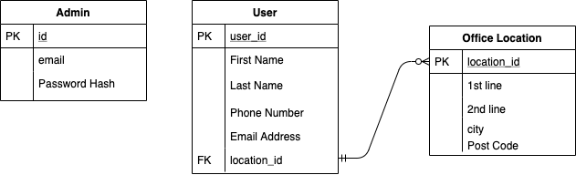

# QACProject

-> Python3

-> Flask

-> SQL Alchemy

-> Selenium

-> Pytest

The Python Micro-Framework Flask is being utilised due to the high amount of integration with components to speed up development. for example SQLAlchemy Models and Flask_WTF Integration for validation and posting errors to the page using Jinja templating (HTML)

Python is seen to be a high level language and is incredibly versatile. many people know python because python does a lot of things!. 
As such further development or making this project opensource could see more collaboration than with other languages.

This Project will use the Feature-Branch Models as well as Test Driven Development. code test coverage must be over 90% to be merged with the development branch for further testing (using Pytest and Selenium)

# Finalised trello board

https://trello.com/b/C6OVfoPZ/qaa

# Finalised ERD

# Finalised Risk Assesstment

Risk assestment can be found [Here](https://docs.google.com/spreadsheets/d/1e9dNWcu6ro9YcTkmCDNhyVzRHGwjEr3RxXqMkqxVKZE/edit?usp=sharing)

# Minimum Viable Product

The Minimum Viable Prodect is defines within the To-Do and This Sprint sections of the Trello Board 

There are other User Stories However they are mostly nice to have or more advances features

# First Sprint

Before I started this phase of development we took the time to produce a primiliminary Risk assestment, While this will be added to within future iterations I felt it was important to see some of the potentials problems before we started on the code. 

As Seen within the Minimum Viable Product only one user story has been chosen for this sprint. This is due to the short sprint time of a day. 
As well as this is one of the more advances features as you can see from the below tasks:

This includes the full system integrated to the Flask Application, with included Integration and Unit Testing so we can continue to ensure it works throughout the project as smaller features are added 

Although this test coverage seems lower than you might expect. This is due to additional functionality needing to be built in due to short comings in the testing procedure. additional tests will be build for the core features we implemented early as well as the more advances ones on top. This will bring up the overall test coverage. 

The ERD also went through changes during the first sprint as you can below 

This was the original ERD. This was however changed to: 

Following Client Feedback and the decision to give users a mean to sign into the system

# Second Sprint

Using Trello we have further decided what we will be doing this sprint. 

This sprint is focussed much more on the core functionality alongside building in usability with basic formatting of pages in order to establish our MVP. 

The Prototype for the main page is shown below 

This will allow us to make a nice and easy to use application with minimal overhead from a design perspective 

At the end of this sprint we had introduced Create and Read Functionality into the application. 

You can see the below Test Coverage Report which was generated by jenkins 

In this sprint i achieved all my goals as well as passed all of the automated testing to allow us to confidently push the code into the dev branch. 

Once i finished the Delete Functionality to the application i ran more tests to confirm the app was still stable before continuing 

After this we hit the update functionality in order to finish the MVP for the CRUD application. we also chose to retest this before we commited back to the 'Dev' Branch. 

Below are the results. 

This concludes the second sprint 

# Third Sprint

In the Third sprint I intend to implement the automated CI/CD Pipeline. This will allow developers and Ops to have to worry less about the testing and the deployment of new builds as this will become automated. 

below is how i feel the CI/CD Pipeline will look 

So lets talk through this. 

Due to python being an interpretive language build servers and artifact repositories are a none requirement. this makes the pipeline less complicated. 

Jenkins and Github will be connected via the Dev Branch web hook. This is implemented so there is a last port of call manual intervention is required to push to the main, However the application will still be able to be deployed from the dev branch. 

This has been done because it is vital the code on the main branch is in an always-functional state. 

This was done due to the new Risk of false positive test results or unexpected errors within the pipeline. 

Jenkins will then run our tests on a running version of the application to ensure there are no breaks. once this is completed it will then deploy our application using Gunicorn WSGI server within a systemd service on the same server

You will require a Jenkins build server. If you need help with the deployment please visit [Here](https://www.tutorialspoint.com/jenkins/jenkins_installation.htm)

