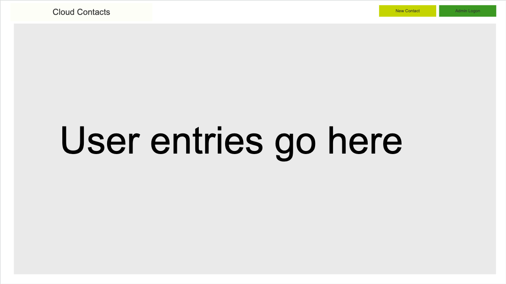

# QACProject

-> Python3

-> Flask

-> SQL Alchemy

-> Selenium

-> Pytest

The Python Micro-Framework Flask is being utilised due to the high amount of integration with components to speed up development. for example SQLAlchemy Models and Flask_WTF Integration for validation and posting errors to the page using Jinja templating (HTML)

Python is seen to be a high level language and is incredibly versatile. many people know python because python does a lot of things!. 
As such further development or making this project opensource could see more collaboration than with other languages.

This Project will use the Feature-Branch Models as well as Test Driven Development. code test coverage must be over 90% to be merged with the development branch for further testing (using Pytest and Selenium)

# Finalised trello board

https://trello.com/b/C6OVfoPZ/qaa

# Finalised ERD

# Finalised Risk Assesstment

Risk assestment can be found [Here](https://docs.google.com/spreadsheets/d/1e9dNWcu6ro9YcTkmCDNhyVzRHGwjEr3RxXqMkqxVKZE/edit?usp=sharing)

# Trello Board progress Tracking 

# Minimum Viable Product

The Minimum Viable Prodect is defines within the To-Do and This Sprint sections of the Trello Board 

There are other User Stories However they are mostly nice to have or more advances features

# First Sprint

As Seen within the Minimum Viable Product only one user story has been chosen for this sprint. This is due to the short sprint time of a day. 
As well as this is one of the more advances features as you can see from the below tasks:

This includes the full system integrated to the Flask Application, with included Integration and Unit Testing so we can continue to ensure it works throughout the project as smaller features are added 

Although this test coverage seems lower than you might expect. This is due to additional functionality needing to be built in due to short comings in the testing procedure. additional tests will be build for the core features we implemented early as well as the more advances ones on top. This will bring up the overall test coverage. 

The ERD also went through changes during the first sprint as you can below 

This was the original ERD. This was however changed to: 

Following Client Feedback and the decision to give users a mean to sign into the system

# Second Sprint

Using Trello we have further decided what we will be doing this sprint. 

This sprint is focussed much more on the core functionality alongside building in usability with basic formatting of pages in order to establish our MVP. 

The Prototype for the main page is shown below 

This will allow us to make a nice and easy to use application with minimal overhead from a design perspective 

At the end of this sprint we had introduced Create and Read Functionality into the application. 

You can see the below Test Coverage Report which was generated by jenkins 

In this sprint i achieved all my goals as well as passed all of the automated testing to allow us to confidently push the code into the dev branch. 

